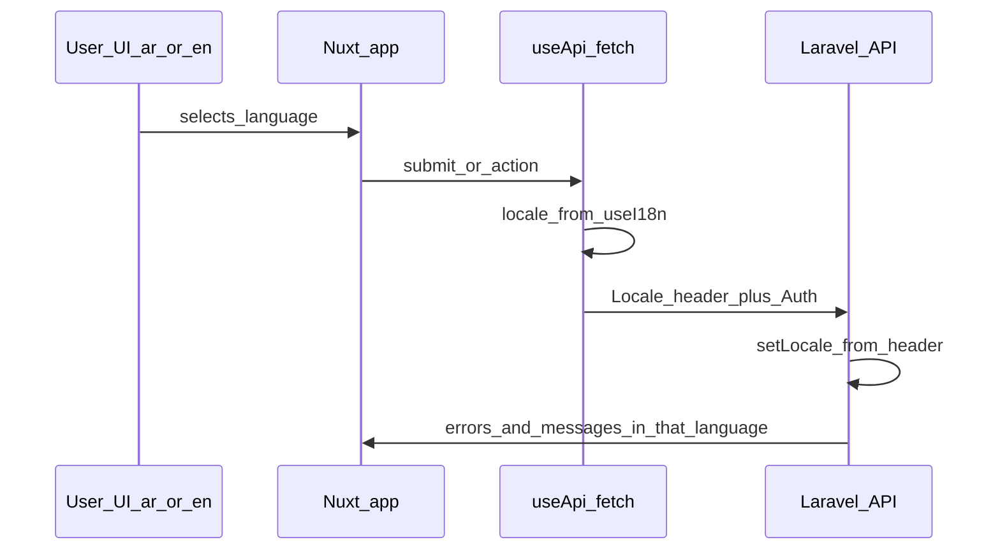

# API authentication and language header (backend handoff)

## Short brief you can send to the backend developer (copy-paste)

> Our Nuxt app uses Arabic and English (`locale` codes **`ar`** and **`en`**, cookie `i18n_locale`).  
> We will send the **currently selected UI language on every API request** (via an agreed HTTP header, e.g. `Accept-Language` or `X-Locale`).  
> Please use that value to set the application locale (e.g. Laravel `App::setLocale()`) so **validation messages, error payloads, and any user-facing `message` fields** are returned in **the same language the user chose** in the UI—not fixed Arabic or English.  
> Authenticated calls will continue to include `Authorization: Bearer <token>`. Please confirm which header name and exact values (`ar`/`en` vs `ar-SA`/`en-US`) you want to support.

---

## Why the backend needs this

The user **selects Arabic or English** in the storefront (`@nuxtjs/i18n`, cookie `i18n_locale`, codes `ar` / `en`). On **any submit or API action**, the API must know **which language is active** so it can:

- Return **validation errors** (per-field and top-level `message`) in **that** language.
- Return other user-facing API strings consistently.

**Contract:** the frontend sends the **active locale on every request**. The backend reads it and **responds with localized content** for that request.

The frontend already prefers `message.ar` vs `message.en` when both appear in JSON ([`app/composables/useApiError.ts`](../../app/composables/useApiError.ts)). Sending locale on the request is still valuable so the backend can return **one** consistent localized payload and use Laravel translations per locale.

---

## Current behavior (today)

| Piece | File | What is sent |
| ----- | ---- | -------------- |
| Main API client | [`app/composables/useApi.ts`](../../app/composables/useApi.ts) | When `authStore.token` is set: `Authorization`, `Accept`, `Content-Type`. **No language header.** |
| i18n config | [`nuxt.config.ts`](../../nuxt.config.ts) | Locale codes **`ar`**, **`en`**; `language` tags `ar-SA`, `en-US` (not sent to API yet). |
| Login / logout | [`app/stores/auth.ts`](../../app/stores/auth.ts) | Raw `$fetch` to `apiBase`: login has `Accept`; logout has `Authorization` + `Accept`. **No language header.** |
| Echo (WS auth) | [`app/plugins/echo.client.ts`](../../app/plugins/echo.client.ts) | `Authorization` only. **No locale.** |

---

## Request headers — target contract (after frontend change)

Agree exact names with backend; example:

| Header | Purpose | Example |
| ------ | ------- | ------- |
| `Authorization` | JWT | `Bearer <token>` |
| `Accept` | JSON API | `application/json` |
| `Content-Type` | JSON body | `application/json` |
| **Locale** (TBD) | User’s UI language | `ar` or `en` (or `ar-SA` / `en-US` if backend prefers BCP-47) |

**Confirm with backend:**

- Header name: `Accept-Language` vs `X-Locale` / `X-Language` / other.
- Value format: short `ar`/`en` vs full tags from Nuxt `language` field.

---

## Recommended frontend implementation (after header is agreed)

1. **[`app/composables/useApi.ts`](../../app/composables/useApi.ts)**  
   - In `onRequest`, merge headers for **every** request (not only when token exists) so locale is always sent when using `$api`.  
   - Read locale via `useI18n()` at setup time (same idea as [`useApiError.ts`](../../app/composables/useApiError.ts)).  
   - Set the agreed locale header; keep `Authorization` + JSON headers when token is present.

2. **Optional — [`app/stores/auth.ts`](../../app/stores/auth.ts)**  
   - Add the same header on **login** (and logout if needed) so login validation errors match UI language. Use `useCookie('i18n_locale')` if `useI18n()` is awkward inside the store.

3. **Optional — [`app/plugins/echo.client.ts`](../../app/plugins/echo.client.ts)**  
   - Only if broadcasting auth must return localized errors.

---

## Flow

---

## Out of scope (unless requested)

- Laravel middleware / implementation on the server.
- Sending locale only as a query parameter (possible alternative; headers are preferred).
